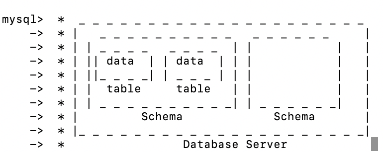

# 20.08.31 공부

## SQL
 * Structured Query Language.
 * 관계형 데이터베이스 서버들이 공통으로 사용하는 언어.

## 관계형 데이터베이스
 * 테이블들을 관계를 맺어 중복을 개선하여 수행능력 및 유지보수 측면의 퍼포먼스를 향상시킬 수 있다.
 * 중복을 최소화 하기위해 테이블을 분리해서 저장하고, 관계형 데이터베이스를 통해 합쳐서 사용자에게 보여줄 수 있다.
 * 이 합치는 기능이 **JOIN**기능이고, 관계형 데이터베이스의 핵심 기능이다.

## mysql
 * 관계형 데이터베이스.
 * Excel과 비슷하게 테이블 형태로 정보를 저장한다.
 * 다른점은 Excel은 입력하는 정보에 대한 제한이 없지만, mysql은 입력되는 정보의 형식을 지정할 수 있다(데이터 타입을 강제할 수 있다).
 * 즉, 정보를 철저하게 관리할 수 있다. 이것이 중요한 특징이다.

## mysql server&client
 * 우리가 터미널에서 사용하는 mysql moniter나 mysqlworkbench모두 mysql client이다.
 * mysql server에 직접 접속하여 조작하는 것이 아닌 client가 요청을 하여 server의 내용을 조작하는 방식으로 작동한다.
 * 다양한 mysql client들이 존재한다.

## mysql 설치
 * terminal 에서 brew install mysql
 * 이후 설치가 완료되면 mysql.server start로 서버를 켜준다
 * mysql_secure_installation 을 통해 mysql의 기본 설정을 진행해준다.
 * mysql -uroot -p(user = root로 mysql 접속) 를 하고 비밀번호를 입력하여 잘 설치되었는지 확인.
 * mysql -uroot -p -hlocalhost : -h부분에 접속할 mysql서버가 있는 주소를 입력한다. localhost에 있는 서버인 경우 생략하면 자동으로 local로 간다.

## mysql의 구조
 * Table에는 비슷한 종류의 데이터들이 들어가있다.
 * 비슷한 속성을 가진 테이블끼리 묶은것이 Database(Schema)
 * 이러한 Database 들을 저장해놓은 곳이 Database Server
 

## Table의 구조
 * 수평으로 되어있는 곳 : row, record, 행.
 * -> 데이터 하나하나, 데이터 자체를 의미.
 * 수직으로 되어있는 곳 : column, 열.
 * -> 데이터의 구조를 의미.

## Database(Schema) 터미널 명령어
 * 생성 : CREATE DATABASE 이름;
 * 삭제 : DROP DATABASE 이름;
 * DB리스트 확인 : SHOW DATABASES;
 * 사용할 DB선택 : USE 이름;

## Table 생성
 * CREATE TABLE 테이블명('컬럼명' 타입(길이) ''' PRIMARY KEY('컬럼명'));
 * 데이터가 가지는 특정 속성의 종류(Type)와 길이(Length)를 설정할 수 있다.
 * NOT NULL : 데이터의 해당 속성이 공백이면 안된다는 것을 의미. NULL이라하면 공백도 입력가능.
 * AUTO_INCRESMENT : 특정 속성이 데이터가 들어올때마다 증가되면서 저장되게 하는 기능. -> 고유한 식별자를 가지게 만들 수 있다.
 * PRIMARY KEY(속성명) : 해당 테이블의 주 키임을 알린다. 또한 중복되는 값이 들어올 수 없도록 막아준다.

## CRUD
 * mysql에서 작용되는 기능들
 * C : create
 * R : read
 * U : update
 * D : delete
 * 주로 create와 read를 많이 사용하고, 특히 read가 가장많이 사용되는 기능이다.

  *  INSERT
    * 해당 테이블에 들어가는 컬럼정보 확인 : DESC 테이블명;
    * INSERT  INTO 테이블명 (데이터의 정보1, 정보2,,,) VALUES('정보1의 값','정보2의 값',,,);

  * SELECT
    * SELECT *FROM 테이블명; : 테이블의 모든 데이터 출력.
    * SELECT 컬럼명 **FROM** 테이블명; : 테이블에서 입력한 컬럼명들의 정보만 출력.
    * SELECT 컬럼명 FROM 테이블명 **WHERE** 컬럼명='원하는값'; : 컬럼명이 특정값인 데이터들만 출력할 수 있다.
    * SELECT 컬럼명 FROM 테이블명 WHERE 컬럼명='원하는값' **ORDER BY** 정렬기준이 될 컬럼명 정렬방식; : ORDER BY 정렬기능
    * SELECT 컬럼명 FROM 테이블명 WHERE 컬럼명='원하는값' **LIMIT** 2; : LIMIT를 통해 출력되는 데이터 수 제한.(데이터를 너무 많이 가져오면 컴퓨터가 멈출 수 있음. 따라서 LIMIT로 제한을 해줘야함.)

  * UPDATE
    * UPDATE 테이블명 SET 바꿀컬럼명='내용' WHERE 조건;
    * 여기서 WHERE로 특정 조건을 걸지 않으면 모든 데이터의 해당 컬럼명에 있는 값들이 바뀐다. 따라서 반드시 WHERE로 조건을 걸어야한다.
    * ex) WHERE id=2

  * DELETE
    * 일단 delete는 거의 쓸일이 없다. 데이터는 많으면 많을수록 좋기 때문이다!!
    * DELETE FROM 테이블명 WHERE 조건 : WHERE을 쓰지 않으면 모든 정보가 날라간다. 반드시 조건 입력하기!!

## 잘하는 방법은 이해하는 것이 아닌 익숙해지는 것이다!
