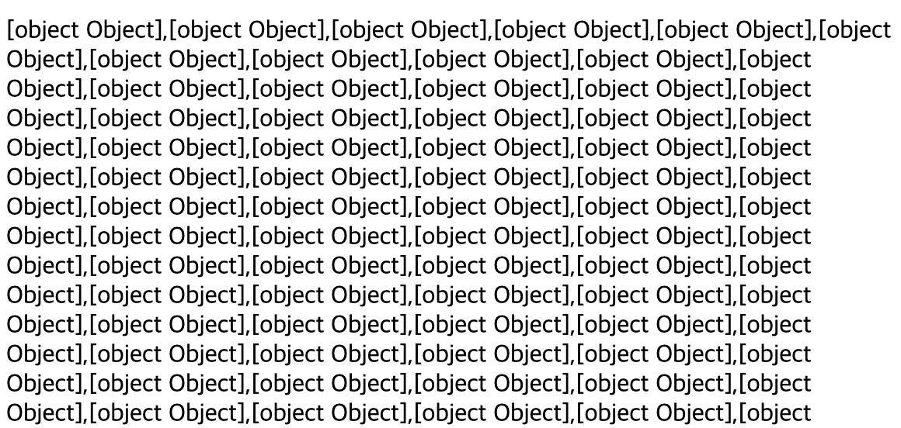
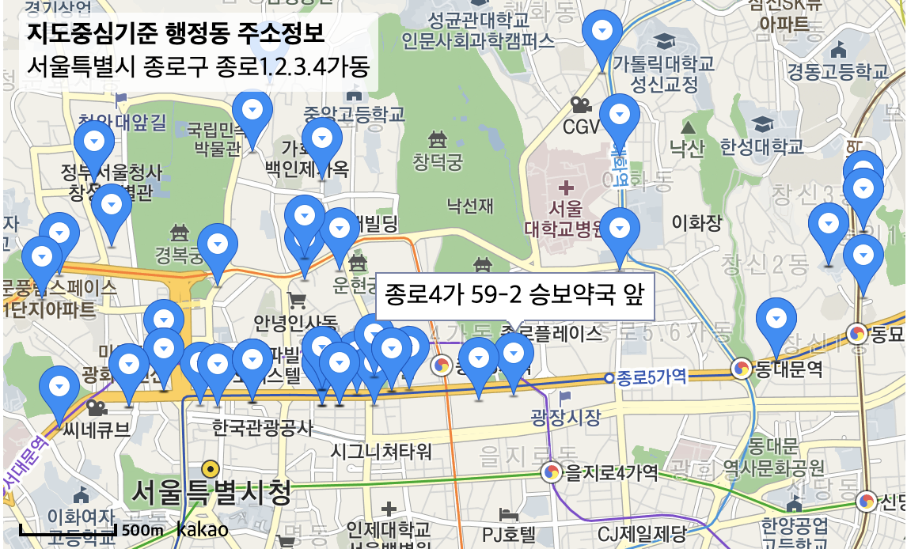

# 20. 09. 20 공부

## javascript에서 json형태의 [object object] 값
  * 이것 때문에 4시간 정도 날린 것 같다.
  * nodejs에서 만든 json형태의 데이터를 javascript에 넣으면 [object, object]라고 나온다.

  
  * json으로 넘긴 파일을 javascript에서 다루려하면 생기는 문제인 것 같다.
  * 아래 코드를 통해 실제 값을 볼 수 있다.

  ```javascript
    JSON.stringify(json_var_name)
  ```

## trash_map 1 단계 완성.
 * 오늘 작업으로써 trash_map 1단계를 완성하였다.

 
 * 개선하고 싶은 사항
  - 마커의 이미지를 쓰래기통이 생각나도록 변경하자!
  - 서울시 쓰래기통 위치 공공데이터를 잘 다듬어 더 많은 쓰래기통 위치를 표시할 수 있도록 하자
  - 코드가 너무 더럽다. 코드정리(제일먼저)
